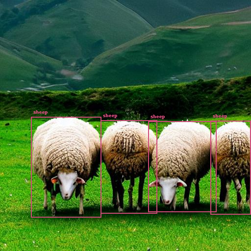

# :parrot: :hugs: :robot: Langchain HuggingGPT

[](https://huggingface.co/spaces/camillevanhoffelen/langchain-HuggingGPT)

A lightweight implementation of [HuggingGPT](https://arxiv.org/abs/2303.17580) with [langchain](https://docs.langchain.com/docs/). 
No local inference, only models available on the [huggingface inference API](https://huggingface.co/inference-api) are used. 

# ToC

* [üöÄ Getting Started](#-getting-started)
* [üëè Usage](#-usage)
* [👀 Examples](#-examples)
* [⚙️ Development](#-development)
* [🤔 Some Thoughts on Why This is Kinda Crap](#-some-thoughts-on-why-this-is-kinda-crap)

## üöÄ Getting Started

Install the package with pip:

```commandline
pip install -r requirements.txt
pip install -e .
```

or with your preferred virtual environment manager (_this project uses [pdm](https://pdm.fming.dev/) for dependency management_).

Setup your OpenAI and Huggingface Hub credentials:

```commandline
cp .env.example .env
```

Then fill in the `.env` file with your `OPENAI_API_KEY` & `HUGGINGFACEHUB_API_TOKEN` credentials.

## üëè Usage

### CLI

```commandline
python main.py
```

Then converse with HuggingGPT, e.g:

```commandline
Please enter your request. End the conversation with 'exit'

User: Draw me a sheep

Assistant: I have carefully considered your request and based on the inference
results, I have generated an image of a sheep for you. The image can be found
at the following URL: /images/1e34.png. The model I used for this task was
runwayml/stable-diffusion-v1-5, as it is specifically designed for
text-to-image tasks and has the highest number of likes. I hope this image
meets your expectations. Is there anything else I can help you with?

User: exit
```


To use the application in standalone mode, use the `--prompt` flag:

```commandline
python main.py --prompt "Draw me a sheep"
```

### Local Gradio


```commandline
python app.py
```

Then open in your browser: [http://localhost:7860/](http://localhost:7860/)

## 👀 Examples


### Image Generation + Image-to-Text + Object Detection + Visual Question Answering


```
Please enter your request. End the conversation with 'exit'

User: Generate an image of a field with three sheep grazing peacefully

Assistant: I have carefully considered your request and based on the inference
results, I have generated an image of a field with three sheep grazing
peacefully. The model I used for this task is runwayml/stable-diffusion-v1-5,
which is the most suitable for the task as it is the most popular model with
the highest number of likes (6367) and it has the most relevant tags
(stable-diffusion, stable-diffusion-diffusers, text-to-image) for the task. The
complete path or url of the generated image is /images/1e70.png. Is there
anything else I can help you with?

User: How many sheep are in the image?

Assistant: Based on the inference results, there are 4 sheep in the image. I
used the following models and inference results to answer your request: 

Model 1: nlpconnect/vit-gpt2-image-captioning. This model is trained by @ydshieh
and is specifically designed for image-to-text tasks. It generated the
text "sheep grazing in a field" from the image. 

Model 2: facebook/detr-resnet-50. This model is suitable for the task of
object-detection as it is specifically designed for this purpose. It has a
ResNet-50 backbone which is a powerful feature extractor and is capable of
detecting objects in an image. It also has a local inference endpoint which
makes it faster and more stable. It generated the image with predicted
boxes "/images/c6fd.png" and predicted 4 sheep in the image. 

Model 3: dandelin/vilt-b32-finetuned-vqa. This model is a Vision-and-Language
Transformer (ViLT) that has been fine-tuned on VQAv2. It is specifically
designed for visual-question-answering tasks, which 

User: exit
```




### Text Generation + Text-to-Speech

```commandline
Please enter your request. End the conversation with 'exit'

User: Write a poem about sheep, then read it to me

Assistant: Sure, I will do my best to answer your request. Based on the
inference results, I have generated a poem about sheep for you. Here is the
poem: 

Sheep in the meadow, Grazing so sweetly, Softly they bleat, In the morning sun
so brightly.

Wool so soft and white, Fleece so warm and light, A gentle reminder of nature's
delight.

Sheep in the meadow, Grazing so peacefully, A reminder of nature's beauty, For
all of us to see. 

To generate this poem, I used the OpenAI model for text generation. The audio
file of the poem can be found at the following URL: /audios/499e.flac. This
audio file was generated using the ESPnet/Kan-Bayashi_LJSpeech_VITS model,
which is imported from https://zenodo.org and has 70 likes. It is an ESPnet2
TTS pretrained model and is specifically designed for text-to-speech tasks.

I hope this answers your request. Is there anything else I can help you with?

User: exit
```

[sheep poem audio](resources/audios/499e.flac)

### Automatic Speech Recognition + Sentence Similarity

```commandline
Please enter your request. End the conversation with 'exit'

User: Transcribe the audio file found at /audios/499e.flac. Then tell me how
similar the transcription is to the following sentence: Sheep are nice.

Assistant: Based on the inference results, the transcription of the audio file
found at /audios/499e.flac is "HERE IS YOUR POEM ABOUT SHEEP SHEEP IN THE
MEADOW GRAZING SO SWEETLY SOFTLY THEY BLEAT IN THE MORNING SUN SO BRIGHTLY
WOOLF SO SOFT AND WHIT FLEECE SO WARM AND LIGHT THE GENTLE REMINDER OF NATURE'S
DELIGHT SHEEP IN THE MEADOW GRAZING SO PEACEFULLY A REMINDER OF NATURE'S BEAUTY
FOR ALL OF US TO SEE". The similarity between the transcription and the
sentence "Sheep are nice" is 0.46181225776672363. 

To complete this task, I used two models: facebook/wav2vec2-base-960h for
automatic speech recognition and sentence-transformers/all-MiniLM-L6-v2 for
sentence similarity. The inference results are the transcription of the audio
file and the similarity score between the transcription and the sentence. The
complete path or url of the audio file is /audios/499e.flac.

User: exit
```


## ⚙️ Development

### Testing

Install test dependencies with pdm:

```commandline
pdm sync
```

Run unit tests with pytest:

```commandline
pdm run pytest
```

Run smoke test:

```commandline
pdm run python tests/smoke_test.py
```

### Implementation Notes

- cleaned up most of the [JARVIS](https://github.com/microsoft/JARVIS) code
- added unit tests
- [langchain](https://docs.langchain.com/docs/) OpenAI API calls and prompt templates
- asyncio model status and model selection API calls
- added missing `sentence-similarity`, `text-classification`, `image-classification`, and `question-answering` task planning examples

This implementation tries to remain as close as possible to the [original research paper](https://arxiv.org/abs/2303.17580)’s prompts and workflows. As such, the whole langchain framework was not used.

### Future work

- Concurrent execution of non-dependent tasks with `asyncio`
- Better support for image-to-image control tasks
- Switch to `gpt-3.5-turbo`
- abandon paper reproducibility and use more of langchain (e.g [Agents](https://python.langchain.com/en/latest/modules/agents.html), [SequentialChains](https://python.langchain.com/en/latest/modules/chains/generic/sequential_chains.html), [HuggingFace Tool](https://python.langchain.com/en/latest/modules/agents/tools/examples/huggingface_tools.html), …)

## 🤔 Some Thoughts on Why This is Kinda Crap

### HuggingGPT Comes Up Short

HuggingGPT is a clever idea to boost the capabilities of LLM Agents, and enable them to solve “complicated AI tasks with different domains and modalities”. In short, it uses ChatGPT to plan tasks, select models from Hugging Face (HF), format inputs, execute each subtask via the HF Inference API, and summarise the results. [JARVIS](https://github.com/microsoft/JARVIS) tries to generalise this idea, and create a framework to “connect LLMs with the ML community”, which Microsoft Research claims “paves a new way towards advanced artificial intelligence”.

However, after reimplementing and debugging HuggingGPT for the last few weeks, I think that this idea comes up short. Yes, it can produce impressive examples of solving complex chains of tasks across modalities, but it is *very* error-prone (try [theirs](https://huggingface.co/spaces/microsoft/HuggingGPT) or [mine](https://huggingface.co/spaces/camillevanhoffelen/langchain-HuggingGPT)). The main reasons for this are:

- HF Inference API models are often not [loaded in memory](https://huggingface.co/docs/api-inference/quicktour#model-loading-and-latency), and loading times are long for a conversational app.
- HF Inference API Models sometimes break (e.g [speechbrain/metricgan-plus-voicebank](https://huggingface.co/speechbrain/metricgan-plus-voicebank)).
- Image-to-image tasks (and others) are [not yet implemented](https://huggingface.co/docs/api-inference/detailed_parameters) in the HF Inference API.

This might seem like a technical problem with HF rather than a fundamental flaw with HuggingGPT, but I think the roots go deeper. The key to HuggingGPT’s complex task solving is its *model selection* stage. This stage relies on a large number and variety of models, so that it can solve arbitrary ML tasks. HF’s inference API offers free access to a staggering 80,000+ open-source models. However, this service is designed to “explore models”, and not to provide an industrial stable API. In fact, HF offer private [Inference Endpoints](https://huggingface.co/docs/inference-endpoints) as a better “inference solution for production”. Deploying thousands of models on industrial-strength inference endpoints is a serious undertaking in both time and money.

Thus, JARVIS must either compromise on the breadth of models it can accomplish tasks with, or remain an unstable POC. I think this reveals a fundamental scaling issue with model selection for LLM Agents as described in HuggingGPT.

### Instruction-Following Models To The Rescue

Instead of productionising endpoints for many models, one can curate a smaller number of more *flexible* models. The rise of [instruction fine-tuned models](https://arxiv.org/pdf/2109.01652.pdf) and their impressive zero-shot learning capabilities fit well to this use case. For example, [InstructPix2Pix](https://huggingface.co/timbrooks/instruct-pix2pix) can approximately “replace” many models for image-to-image tasks. I speculate few instruction fine-tuned models needed per modal input/output combination (e.g image-to-image, text-to-video, audio-to-audio, …). This is a more feasible requirement for a stable app which can reliably accomplish complex AI tasks. Whilst instruction-following models are not yet available for all these modality combinations, I suspect this will soon be the case.

Note that in this paradigm, the main responsibility of the LLM Agent shifts from model selection to the task planning stage, where it must create complex natural language instructions for these models. However, LLMs have already demonstrated this ability, for example with crafting prompts for stable diffusion models.

### The Future is Multimodal

In the approach described above, the main difference between the candidate models is their input/output modality. When can we expect to unify these models into one? The next-generation “AI power-up” for LLM Agents is a single multimodal model capable of following instructions across any input/output types. Combined with [web search](https://python.langchain.com/en/latest/modules/agents/tools/examples/serpapi.html) and [REPL](https://python.langchain.com/en/latest/modules/agents/tools/examples/python.html) integrations, this would make for a rather “advanced AI”, and research in this direction is [picking up steam](https://imagebind.metademolab.com/)!

## License

[MIT license](LICENSE)

## Credits

* [JARVIS](https://github.com/microsoft/JARVIS)

